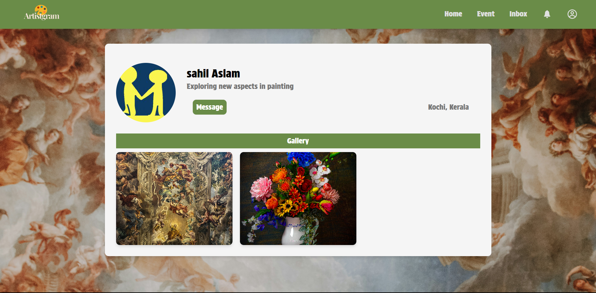
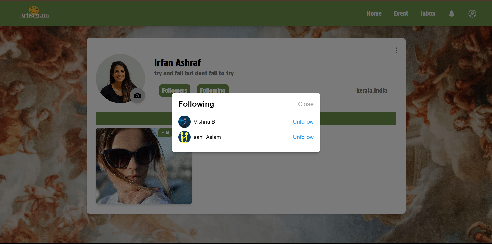
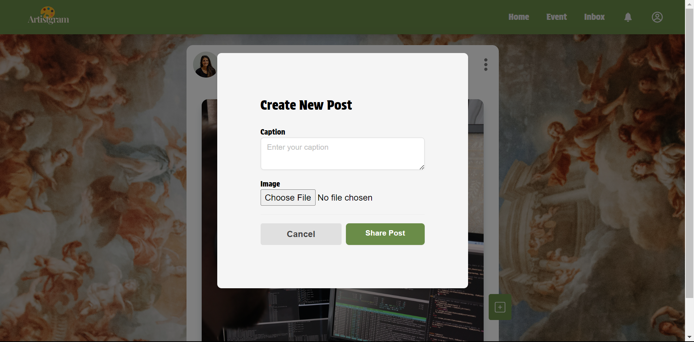
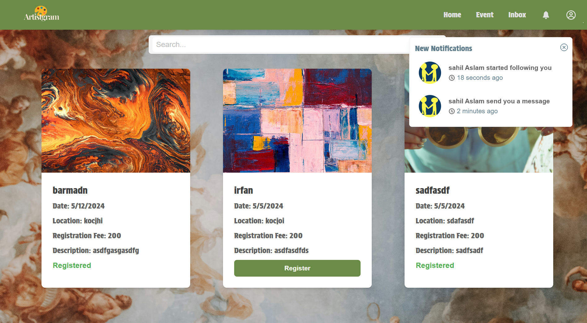
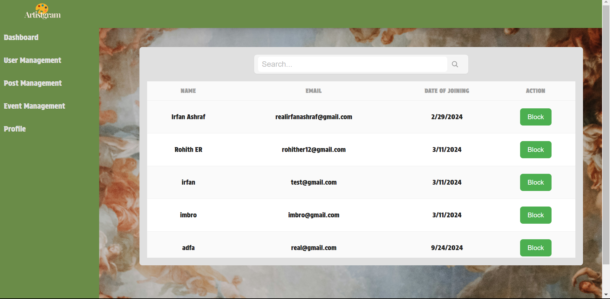
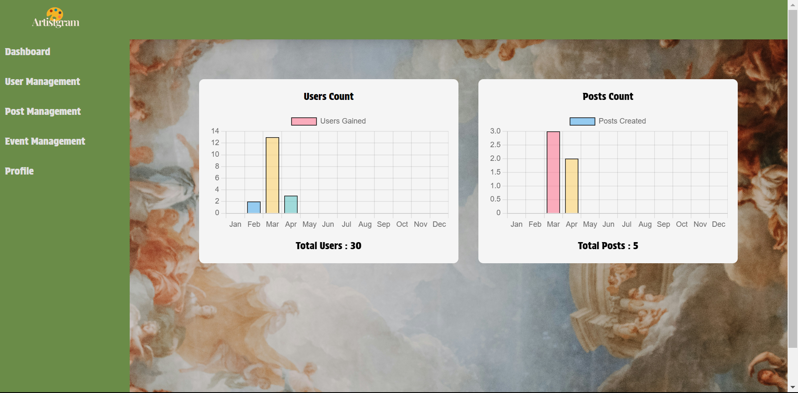

# Artistgram

## Overview

**Artistgram** is a social media platform designed specifically for visual artists and their fans. While many social media platforms for general audiences, Artistgram offers a unique space for artists to share their artwork and connect with fans in a supportive community. Fans can rate posts, chat, and even video call their favorite artists, fostering deeper interactions.

## Purpose

Artistgram was created to fill the gap in social media for visual artists. It provides a dedicated platform where artists can showcase their work, and fans can engage meaningfully through ratings, chats, and video calls. The platform aims to strengthen the connection between artists and their followers, offering opportunities for real-time interactions and event registrations.

## Key Features

- **Authentication**: Secure login and session management.
- **Post Sharing & Rating**: Artists upload artwork, and users rate posts on a 5-star scale.
- **Real-time Notifications**: Users receive notifications when others interact with their posts (follow, rate, etc.).
- **Chat & Video Calls**: Peer-to-peer messaging and video calls powered by WebRTC and Socket.IO.
- **Event Registration**: Users can register for artist events and purchase tickets via Stripe.
- **Profile & Post Management**: Users manage their profiles and artwork, including post creation, editing, and deletion.

## Technology Stack

- **Frontend**: React with TailwindCSS for responsive and dynamic user interfaces.
- **Backend**: Node.js with Express for robust server-side functionality.
- **Database**: MongoDB with Mongoose for data management and persistence.
- **Real-time Communication**: WebRTC for video calls, and Socket.IO for notifications and chat services.
- **Email Integration**: Nodemailer for sending transactional and confirmation emails.
- **Payment Integration**: Stripe for secure event ticket transactions.

## Key Libraries

- **React**: For building the dynamic UI.
- **WebRTC**: Enables peer-to-peer video calls.
- **Socket.IO**: Provides real-time chat and notification services.
- **Nodemailer**: Sends transactional emails (e.g., event confirmation).
- **Stripe**: Handles secure payment processing.

## Image Preview

Here are some preview images showcasing the app:

