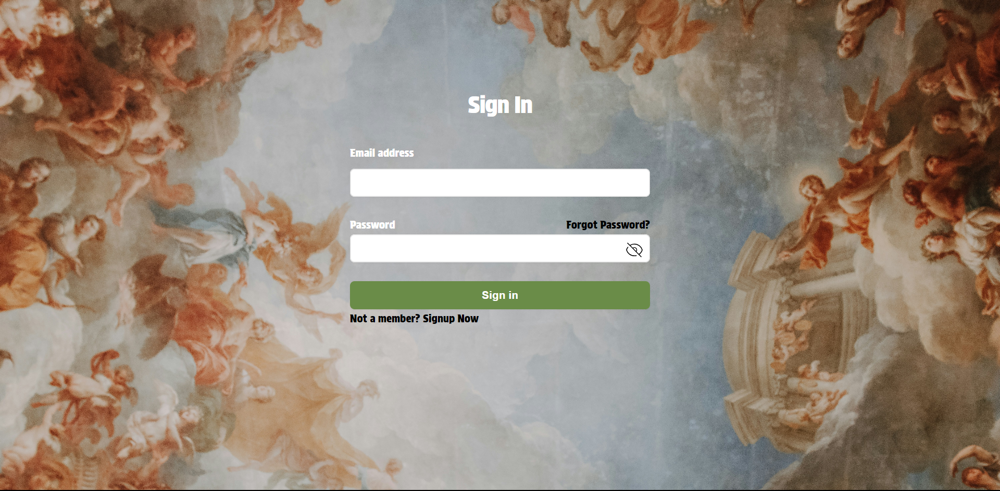
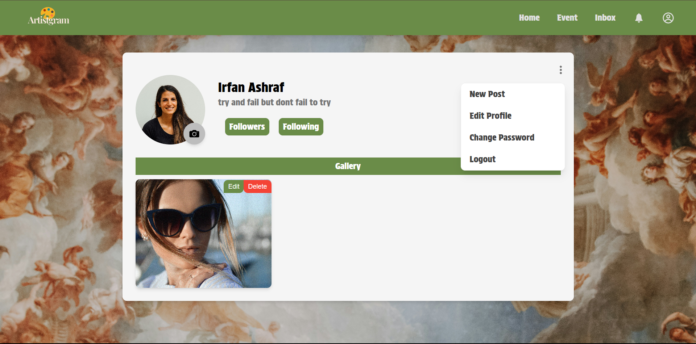
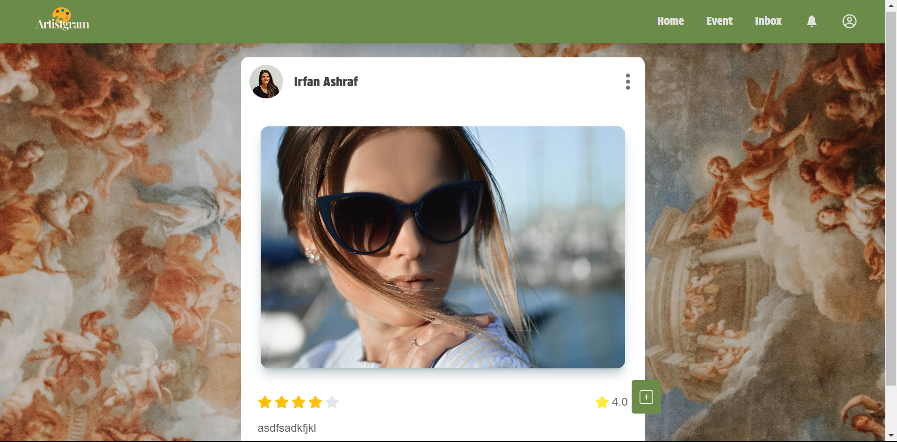
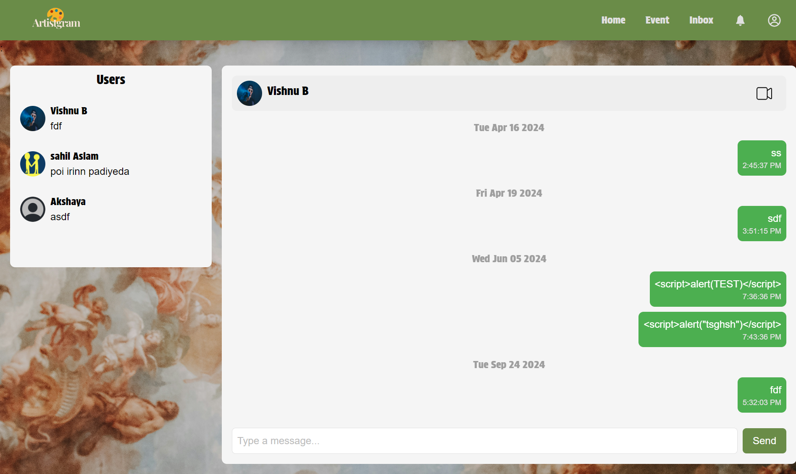

# Artistgram

**Artistgram** is a social media platform designed to connect users with artists from various fields. Built using modern technologies such as **React**, **MongoDB**, **Express**, **Node.js**, and styled with **TailwindCSS**, this app provides a seamless way for users to interact with their favorite artists.

## Key Features

- **Post & Rate**: Users can share posts, rate artworks, and interact with the community.
- **Real-time Interactions**: Integrated with **Socket.IO** for live chat and **WebRTC** for video calling.
- **Follow Artists**: Keep track of your favorite artists by following their profiles and seeing their latest posts.
- **Secure Payments**: Powered by **Stripe** to facilitate secure payments for exclusive content or commissioned work.

## Image Preview

Here are some preview images showcasing the app:

